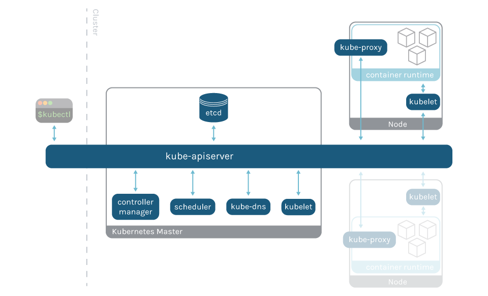
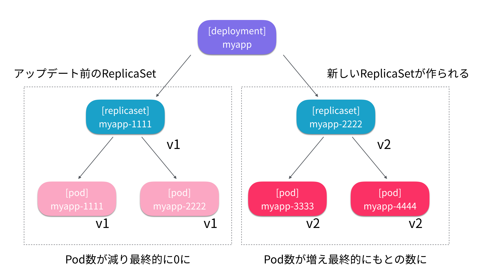

# Dockerとは？

DockerとはDocker社が2013年に開発したコンテナ仮想化のためのOSS

- 仮想マシン: ホストOS上でハイパーバイザーを起動しその上にゲストOSを起動する形で動作する
- コンテナ: ホストOSのカーネルを共有しつつ分離されたプロセスとして実行する環境

Dockerのようなコンテナ環境ではDockerfileという定義ファイルで同一のコンテナイメージを簡単に作成可能

Docker Hubといったコンテナレジストリによるエコシステムが整備されている

インフラチームとアプリケーションチームで分業している組織だと、
初期設定後にミドルウェア設定変更などが必要になるたび、インフラチームに依頼する必要がある

Dockerを利用することでインフラチームへの依頼が不要になり上記のような組織的な課題を解決できる

Dockerには上記の例を始めとした多くのメリットがあるが、一方で問題も抱えている

システム構成が拡大してくると、複数のコンテナを連動して一つのサービスを実現することになる

多くのコンテナが乱立していくと、コンテナ間の通信と可用性の確保が課題となってくる

もし、コンテナが稼働している仮想マシンに問題があれば、すべてのコンテナが停止してサービス全体の停止に繋がることも考えられる

Kubernetes（以降、k8s）のようなコンテナオーケストレーションツールは多くのコンテナを運用する上での課題を解決するために存在する

# k8sとは？

k8sとはGoogle社が2014年に開発したコンテナオーケストレーションツール

k8sではデータプレーンと呼ばれるサーバを複数起動し、その上に仮想的なオーケストレーションレイヤーを構築し、そこでコンテナを起動する

これによってコンテナ利用者からはコンテナ群を一つの大きなマシンリソースとして透過的に見ることができ、インフラを抽象化することができる

k8sのコントロールプレーンは以下のよう

k8sの習得ハードルが一定以上となっているのは下記図のコントロールプレーンやその他のコンポーネントが存在するから

## k8sの基本オブジェクト

- Pod: k8sの最小単位。1つのPod内には1つ以上のコンテナが稼働できる
- ReplicaSet: Podをいくつ起動するか管理するオブジェクト
- Deployment: デプロイ履歴を管理。ロールバックなどの適用を行える。本番運用でPodを起動する場合はDeployment単位で起動することが多い
- Service: デプロイしたPodをk8sクラスター外部へ公開するための仕組みを提供するコンポーネント

オブジェクトの関係性は以下のようになっている

# Amazon EKS

k8sの適用を検討する上で最も障壁となるのは、コントロールプレーンの維持運用の難しさで、
その維持運用をAWSが代行（マネージド）してくれるのがAmazon EKS(Elastic Kubernetes Service)

EKSは以下のコンポーネントがマネージド

- kube-apiserver
- kube-scheduler
- controller
- CoreDNS

## EKSの特徴

- VPCとの統合: EKSではAmazon VPC(Virtual Private Network)統合ネットワーキングがサポートされており、PodにVPC内で使用しているアドレス帯域を使用することができる。クラスター外部との通信をシームレスに実現できる。
- IAMによる認証認可: Amazon IAM(Identity and Access Management)のIAMユーザやIAMロールを使っってクラスターへの認証認可を行える
- ELBとの連携: EKSではServiceを作成するときにロードバランサーを指定するとELB(Elastic Load Balancing)が自動生成される
- データプレーンの選択肢: EC2、Fargateからメリデリを考えながら選択できる

# 補足

[ソースコード](https://github.com/kazusato/k8sbook)
[著書のフォローサイト](https://www.ric.co.jp/pdfs/contents/pdfs/1235_support.pdf)