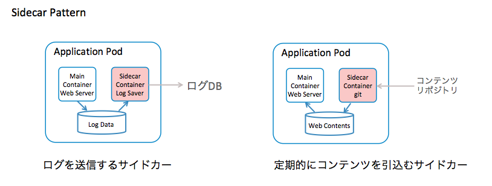
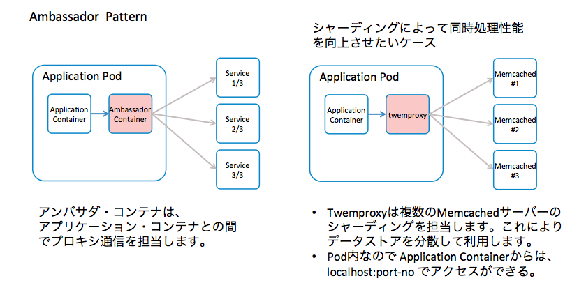
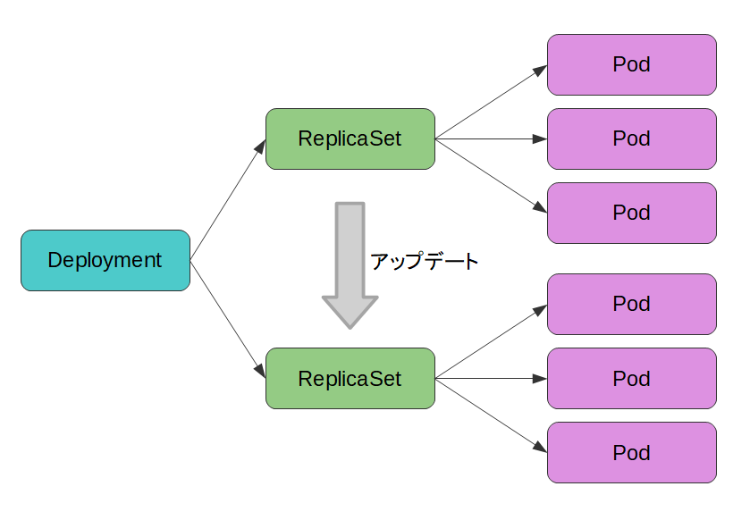
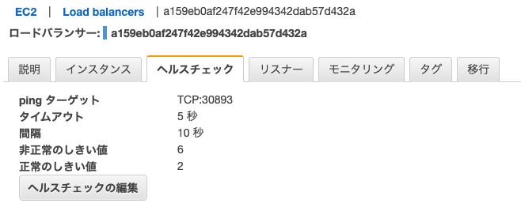

# Kubernetes

## Containerを動かすためのリソース

pod, replicaset, service, deployment

```
$ kubectl get all
NAME                              READY   STATUS             RESTARTS      AGE
pod/backend-app-89b68f9fc-gj94v   1/1     Running            0             45h
pod/backend-app-89b68f9fc-mrbn2   1/1     Running            0             45h
pod/batch-app-28144040-wzh89      0/1     CrashLoopBackOff   3 (20s ago)   63s

NAME                          TYPE           CLUSTER-IP     EXTERNAL-IP                                                                  PORT(S)          AGE
service/backend-app-service   LoadBalancer   10.100.61.85   a159eb0af247f42e994342dab57d432a-47984927.ap-northeast-1.elb.amazonaws.com   8080:30893/TCP   45h

NAME                          READY   UP-TO-DATE   AVAILABLE   AGE
deployment.apps/backend-app   2/2     2            2           46h

NAME                                    DESIRED   CURRENT   READY   AGE
replicaset.apps/backend-app-89b68f9fc   2         2         2       46h

NAME                      SCHEDULE      SUSPEND   ACTIVE   LAST SCHEDULE   AGE
cronjob.batch/batch-app   */5 * * * *   False     1        63s             17m

NAME                           COMPLETIONS   DURATION   AGE
job.batch/batch-app-28144035   0/1           6m3s       6m3s
job.batch/batch-app-28144040   0/1           63s        63s
```

Nginxコンテナを単体で動かす場合の設定ファイル

```
apiVersion: v1 // マニフェストファイルの仕様のバージョン
kind: Pod // オブジェクトの種類
metadata:
  name: nginx-pod // Podの名前を指定
  labels:
    app: nginx-app // Podに対するラベル
spec:
  containers: // このPodに属するコンテナ
  - name: nginx-container
    image: nginx
    ports:
      - containerPort: 80 // コンテナが公開するポート
```

k8sにおけるラベルはリソースの識別に利用される

DeveopmentやServiceのマニフェストのselecter項目に対象とするPodのラベルを指定する

複数コンテナを含むPodは本書では利用していない

1つのPodに含まれるコンテナは

- お互いにlocalhostで通信できる
- ストレージ（ボリューム）を共有できる

これらのコンテナは必ずセットで起動・停止される

同時に利用される場合のデザインパターンは以下のようなものがある

- サイドカーパターン



- アンバサダーパターン



デザインパターンの記事: https://qiita.com/MahoTakara/items/03fc0afe29379026c1f3

Pod初期化用コンテナは以下の利用目的

- アプリケーション本体では必要ないツールを用いて初期化処理を行う
- 同梱するとメインコンテナのセキュリティを低下させてしまうツールを用いて初期化処理を行うことができる
- 初期化処理とアプリケーション本体を独立してビルド・デプロイができる

APIアプリケーションの場合、Deploymentがk8sクラスターに登録されると、
ReplicaSetが作られ、ResplicaSetからPodが作られ、Podの中でコンテナが動くという仕組みになっている

## Podの多重化やバージョンアップ・ロールバックを実現するDeployment

Podを用いればk8s cluster上でプログラムを動かせるが、ウェブアプリケーションを動かす場合はPodを直接デプロイすることはそうない

通常直接PodをデプロイしないでDevelopmentというオブジェクトを作り、間接的にPodをデプロイする

Deploymentを用いてアプリケーションをデプロイすると有効Pod数を維持するようにPodを自動で増減してくれる

Delopoymentを利用することで直接Podをデプロイしたのでは実現できない様々な非機能的な処理をk8sの仕組みで行うことができる



```
apiVersion: apps/v1 // マニフェストファイルのバージョン
kind: Deployment // オブジェクトの種類
metadata:
  name: backend-app // Deploymentの名前を指定
  labels:
    app: backend-app // Deploymentに対するラベル
spec:
  replicas: 2 // Deploymentを通じてクラスター内にデプロイされるPodの数を指定
  selector: / selecterのmatchLabelsはラベルと同様のものを指定
    matchLabels:
      app: backend-app
  template: // Deploymentを通じてデプロイするPodの定義
    metadata:
      labels:
        app: backend-app // ラベル名
    spec:
      containers:
        - name: backend-app // コンテナ名
          image: 761624429622.dkr.ecr.ap-northeast-1.amazonaws.com/k8sbook/backend-app:1.1.0 // コンテナイメージ名
          imagePullPolicy: Always
          ports:
          - containerPort: 8080 // コンテナが公開するポートを指定
          env: // 本Podで仕様する環境変数をSecretというオブジェクトを用いて設定するための記述
            - name: DB_URL
              valueFrom:
                secretKeyRef:
                  key: db-url
                  name: db-config
            - name: DB_USERNAME
              valueFrom:
                secretKeyRef:
                  key: db-username
                  name: db-config
            - name: DB_PASSWORD
              valueFrom:
                secretKeyRef:
                  key: db-password
                  name: db-config
          readinessProbe: // コンテナが起動したか、正常動作しているかをチェックする仕組み
            httpGet:
              port: 8080
              path: /health
            initialDelaySeconds: 15
            periodSeconds: 30
          livenessProbe: // コンテナが起動したか、正常動作しているかをチェックする仕組み
            httpGet:
              port: 8080
              path: /health
            initialDelaySeconds: 30
            periodSeconds: 30
          resources: // Podが仕様するメモリやCPUなどのリソース量についての定義
            requests:
              cpu: 100m
              memory: 512Mi
            limits:
              cpu: 250m
              memory: 768Mi
          lifecycle:
            preStop:
              exec:
                command: ["/bin/sh", "-c", "sleep 2"]
```

Deploymentが直接Podをデプロイするわけではなく、その間にReplicaSetという別のオブジェクトが作成されている

Pod数の増減やPod障害時の自動再起動を実質的に実行しているのはReplicaSet

```
$ kubectl get deployment
NAME          READY   UP-TO-DATE   AVAILABLE   AGE
backend-app   2/2     2            2           2d9h
$ kubectl get replicaset
NAME                    DESIRED   CURRENT   READY   AGE
backend-app-89b68f9fc   2         2         2       2d9h
$ kubectl get pod
NAME                          READY   STATUS    RESTARTS   AGE
backend-app-89b68f9fc-gj94v   1/1     Running   0          2d9h
backend-app-89b68f9fc-mrbn2   1/1     Running   0          2d9h
```

kubectl describeコマンドで詳細情報を取得する場合は以下のコマンドを使う

```
$ kubectl describe リソース種別名 オブジェクト名
```

```
$ kubectl describe pod backend-app-89b68f9fc-gj94v
Name:             backend-app-89b68f9fc-gj94v // Podの名称
Namespace:        eks-work // Podが作成されているNamespace名
Priority:         0
Service Account:  default
Node:             ip-192-168-1-107.ap-northeast-1.compute.internal/192.168.1.107 // Podが配置されているノード名
Start Time:       Tue, 04 Jul 2023 22:37:53 +0900 //  Podの起動日時
Labels:           app=backend-app // Deploymentの記載したラベル
                  pod-template-hash=89b68f9fc
Annotations:      <none>
Status:           Running // Podのステータス
IP:               192.168.1.99 // Podに割り当てられたIPアドレス
IPs:
  IP:           192.168.1.99
Controlled By:  ReplicaSet/backend-app-89b68f9fc // Podを制御している上位オブジェクト
Containers: // コンテナ単位の状態
  backend-app:
    Container ID:   containerd://018718715bfc2efbbd7e38b98da5df257e0ac8522997e117eca8cb5b0a64d4c0
    Image:          761624429622.dkr.ecr.ap-northeast-1.amazonaws.com/k8sbook/backend-app:1.1.0 // コンテナイメージ名
    Image ID:       761624429622.dkr.ecr.ap-northeast-1.amazonaws.com/k8sbook/backend-app@sha256:23184d18681afb6957d5699c21c9d22683cacd7d1201c2091b79f13e711ad436
    Port:           8080/TCP // コンテナが使用するプロトコルとポート番号
    Host Port:      0/TCP
    State:          Running
      Started:      Tue, 04 Jul 2023 22:37:54 +0900
    Ready:          True
    Restart Count:  0
    Limits: // リソース制限
      cpu:     250m
      memory:  768Mi
    Requests: // リソース制限
      cpu:      100m
      memory:   512Mi
    Liveness:   http-get http://:8080/health delay=30s timeout=1s period=30s #success=1 #failure=3 // Podのヘルスチェック Liveness Probe
    Readiness:  http-get http://:8080/health delay=15s timeout=1s period=30s #success=1 #failure=3 // Podのヘルスチェック Readiness Probe
    Environment: // k8sによってこのPodに設定されている環境変数。これはdb-configというsecretから割り当てられている
      DB_URL:       <set to the key 'db-url' in secret 'db-config'>       Optional: false
      DB_USERNAME:  <set to the key 'db-username' in secret 'db-config'>  Optional: false
      DB_PASSWORD:  <set to the key 'db-password' in secret 'db-config'>  Optional: false
    Mounts:
      /var/run/secrets/kubernetes.io/serviceaccount from kube-api-access-b4j9l (ro)
Conditions:
  Type              Status
  Initialized       True 
  Ready             True 
  ContainersReady   True 
  PodScheduled      True 
Volumes: // マウントされているボリュームの情報
  kube-api-access-b4j9l:
    Type:                    Projected (a volume that contains injected data from multiple sources)
    TokenExpirationSeconds:  3607
    ConfigMapName:           kube-root-ca.crt
    ConfigMapOptional:       <nil>
    DownwardAPI:             true
QoS Class:                   Burstable
Node-Selectors:              <none>
Tolerations:                 node.kubernetes.io/not-ready:NoExecute op=Exists for 300s
                             node.kubernetes.io/unreachable:NoExecute op=Exists for 300s
Events:                      <none>
```

## CronJobによるスケジュール起動

CronJobはk8s上でプログラムを時刻あるいは時間間隔を指定して起動するための仕組み

```
apiVersion: batch/v1 // CronJobに対するAPIバージョン
kind: CronJob // リソース種別
metadata:
  name: batch-app // CronJobの名前
spec:
  schedule: "*/5 * * * *" # min hour day-of-month month day-of-week // スケジュール定義
  jobTemplate: // jobの定義
    spec:
      template:
        spec:
          containers:
            - name: batch-app // コンテナの名前
              image: ${ECR_HOST}/k8sbook/batch-app:1.0.0 // イメージ
              imagePullPolicy: Always
              env: // 複数のSecret及びConfigMapから値を取得する
                - name: DB_URL
                  valueFrom:
                    secretKeyRef:
                      key: db-url
                      name: db-config
                - name: DB_USERNAME
                  valueFrom:
                    secretKeyRef:
                      key: db-username
                      name: db-config
                - name: DB_PASSWORD
                  valueFrom:
                    secretKeyRef:
                      key: db-password
                      name: db-config
                - name: CLOUD_AWS_CREDENTIALS_ACCESSKEY
                  valueFrom:
                    secretKeyRef:
                      key: aws-accesskey
                      name: batch-secret-config
                - name: CLOUD_AWS_CREDENTIALS_SECRETKEY
                  valueFrom:
                    secretKeyRef:
                      key: aws-secretkey
                      name: batch-secret-config
                - name: CLOUD_AWS_REGION_STATIC
                  valueFrom:
                    configMapKeyRef:
                      key: aws-region
                      name: batch-app-config
                - name: SAMPLE_APP_BATCH_BUCKET_NAME
                  valueFrom:
                    configMapKeyRef:
                      key: bucket-name
                      name: batch-app-config
                - name: SAMPLE_APP_BATCH_FOLDER_NAME
                  valueFrom:
                    configMapKeyRef:
                      key: folder-name
                      name: batch-app-config
                - name: SAMPLE_APP_BATCH_RUN
                  valueFrom:
                    configMapKeyRef:
                      key: batch-run
                      name: batch-app-config
          restartPolicy: OnFailure
```


CronJobをk8sクラスターに登録して指定した実行時刻が来ると内部的にJobというリソースが作られ、Jobの中でPodが作られる

CronJobの場合、CronJob -> Job -> Podという流れで作られていく


CronJob、Job、Podのそれぞれの守備範囲をはっきりさせておく

- Cronフォーマットによる時間の管理
- 重複するジョブの制御など(詳細は後ほど)
- Jobのステータス管理
- Jobが正常に完了したかどうかをモニタリング
- 過去履歴の保持(成功/失敗それぞれ)

Job

- Podのコンフィグ管理
- Podのステータス管理
- 失敗時のリトライ有無
- 失敗時のタイムアウト時間
- 並行実行数
- "成功"と判定するために必要な完了数

Pod

- Jobが持つPodのコンフィグを継承、任意のイメージで任意のジョブを実行する(Deploymentのように継続実行ではなく、ジョブを終えるとexitすることが期待される)

## Jobリソースの振る舞い

Jobとは一定の処理を行なって完了するタスクを実行するためのリソース

設定内容によっては複数の処理を並行起動することができる

ジョブの実行数を規定するパラメータには .spec.completions .spec.parallelism がある

ジョブの実行パターン

1. 単一のPodを実行する実行パターン
2. 完了すべきPodの数を指定する実行パターン
3. ワークキュー型の実行パターン

それぞれ.spec.completions .spec.parallelismのパラメータを適切に設定することで実装可能

ジョブのリトライ回数はパラメータは.spec.backoffLimitでデフォルト6

同時実行制御のパラメータは.spec.concurrencyPolicyはでデフォルトは1の「Allow」

k8sドキュメントCron Job Limitationsには以下の記述がある

https://kubernetes.io/docs/concepts/workloads/controllers/cron-jobs/

```
基本的にはCronJobからは1つの実行タイミングに1つのJobオブジェクトが作成されるものの、
稀ではあるが、CronJobオブジェクトから複数のJobオブジェクトが作成されることがあるため、ジョブは冪等性を持つように作成すべき
```

## 各ノードに必ず１つPodを立ち上げるDaemonSet

k8sクラスターにDaemonSetを登録すると、
その中で定義されたPodがクラスターに所属しているワーカーのーどごとに一つずつ起動される

DaemonSetのユースケースとしてはログ収集用のエージェントを各ノードで立ち上げるというものがある

## 永続化データを扱うためのStatefulSet

ReplicaSetを使うことでPodが異常終了した場合でも自動的にPodを再起動したり他のノードに再作成したりして
所定のPod数を維持できる仕組みになっている

つまりReplicaSetからPodが再作成される場合、そのPodは毎回初期状態で起動される

ただし、コンテナが初期状態になるとデータベースのように保持しているデータまで初期化されるのは困る

Podの外にVolumeという形でデータを保持し、Podが再起動された場合でもそれまで使っていたVolumeを引き継ぐ仕組みがStatefulSet

StatefulSetとはk8sがステートフルな状態をもつために必要

Namespaceはコンテナを動かす環境であるクラスターを論理的に分割して管理・運用するためのリソース

k8sでは標準で

- default: 明示的にNamespaceを指定しなかった場合に使用されるNamespace
- kube-system: k9sによって作られるオブジェクトが利用するNamespace
- kube-public: 未認証ユーザを含むすべてのユーザから参照できるNamespace

の3つのNamespaceが存在すると定義されている

Namespaceは単にリソースをハンチする論理的な区分だけでなくResouceQuoraやNetworkPolicyといった仕組みと併用することで、
リソース使用量やネットワーク通信の制限などを行うことができる

## Namespaceを定義するマニフェストファイル

Namespaceの作成

```
apiVersion: v1
kind: Namespace // リソースの種別
metadata:
  name: eks-work // 作成するNamespaceの名前
```

※　Deploymentの更新とロールバック

## コンテナを公開するためのリソース

複数のPodをServiceで束ねることで単一のDNSでアクセスできるようになる

Serviceを用いていることで正常に稼働しているPodにリクエストを振り分けることができる

```
apiVersion: v1 // Serviceリソースのバージョン
kind: Service // リソース種別
metadata:
  name: backend-app-service // Serviceリソースの名前
spec:
  type: LoadBalancer // Serviceの種類
  selector:
    app: backend-app // Serviceが対象するPodを選択するためのセレクター定義
  ports: // サービスにサクセスするためのプロトコルとポート割り当て
    - protocol: TCP
      port: 8080
      targetPort: 8080
```

[Serviceの種類](https://ameblo.jp/bakery-diary/entry-12614040050.html)

- ClusterIP
- NodePort
- LoadBalancer
- ExternalName

LoadBalancerはクラスター外にロードバランサーが作成される

クラウドプロバイダーによるがAWSのEKSの場合はELBのロードバランサー（CLB/NLB）が作成される



## 設定情報などを安全に注入する仕組み

~

## Podを安全に停止するための考慮

~

## リソースマネジメント

~


~
